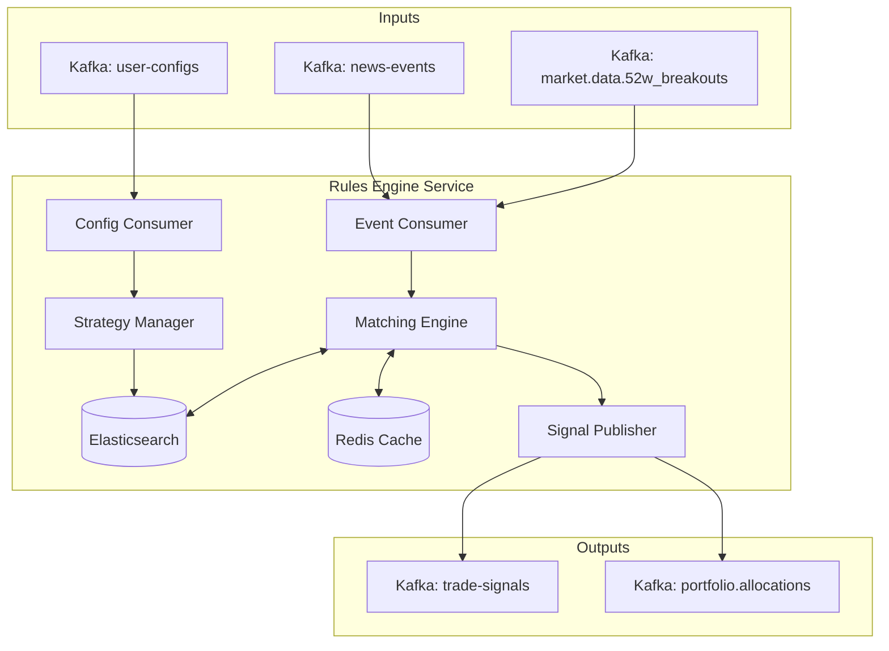

# Rules Engine Service - Knowledge Transfer Documentation

## Table of Contents
1. [Overview](#overview)
2. [Architecture](#architecture)
3. [Core Components](#core-components)
4. [Matching Logic](#matching-logic)
5. [Data Flow](#data-flow)
6. [Configuration](#configuration)
7. [Elasticsearch Integration](#elasticsearch-integration)
8. [Setup & Deployment](#setup--deployment)
9. [Testing](#testing)
10. [Monitoring & Troubleshooting](#monitoring--troubleshooting)

---

## 1. Overview

### Purpose
The **Rules Engine Service** is the "brain" of the algorithmic trading system. It is responsible for evaluating real-time market events (news, price breakouts) against thousands of user-defined trading strategies to generate actionable trade signals.

### Key Responsibilities
- **Event Processing**: Consumes high-velocity market data and news events.
- **Strategy Indexing**: Maintains a searchable index of active user strategies in Elasticsearch.
- **Pattern Matching**: Matches incoming events against strategies in near real-time.
- **Signal Generation**: Produces `TradeSignal` events for the Trade Execution Service.
- **State Management**: Uses Redis to prevent duplicate signals and manage state.
- **52-Week High/Low Engine**: Specialized engine for tracking and acting on 52-week breakout events.

### Technology Stack
- **Language**: Go 1.21+
- **Search Engine**: Elasticsearch 8.x (Strategy indexing and reverse search)
- **Cache**: Redis (Deduplication, state tracking)
- **Message Queue**: Kafka (Input: events/configs, Output: signals)
- **Protocol**: gRPC (Port 9003)

---

## 2. Architecture

### High-Level Design



### Design Patterns
- **Reverse Search (Percolation-style)**: Instead of searching for data, we index "queries" (strategies) and match "documents" (events) against them.
- **Event-Driven Architecture**: Fully decoupled via Kafka.
- **Worker Pool**: Concurrent processing of incoming events.
- **Optimistic Concurrency**: Handling strategy updates.

---

## 3. Core Components

### 3.1 Strategy Manager
**Purpose**: Ensures the Elasticsearch index is in sync with the PostgreSQL database (source of truth).
- Listens to `user-configs` topic.
- Handles `CREATE`, `UPDATE`, `DELETE`, `ACTIVATE`, `DEACTIVATE` events.
- Normalizes data (e.g., converting "NSE" to standard format) before indexing.

### 3.2 Event Consumer
**Purpose**: Ingests market data.
- **News Consumer**: Listens to `news-events`. Payload includes sentiment, impact score, and tickers.
- **Breakout Consumer**: Listens to `market.data.52w_breakouts`. Payload includes stock code, breakout type, and price.

### 3.3 Matching Engine
**Purpose**: The core logic that queries Elasticsearch.
- Constructs dynamic queries based on event attributes.
- Example: "Find all active strategies where `stock_code` matches event OR `stock_code` is ALL, AND `sentiment` matches event, AND `impact_score` <= event score."

### 3.4 Signal Publisher
**Purpose**: Formats and sends trade signals.
- Topic: `trade-signals`
- Ensures signals adhere to the schema required by Trade Execution Service.

---

## 4. Matching Logic

### News Event Matching
When a news event arrives:
```json
{
  "stock_code": 12345,
  "sentiment": "POSITIVE",
  "impact_score": 8,
  "category": "EARNINGS"
}
```

The engine queries Elasticsearch for strategies that:
1. Are **Active** (`active: true`).
2. Target this **Stock** OR all stocks.
3. Accept **POSITIVE** sentiment.
4. Have a minimum impact score threshold **<= 8**.
5. Include the category **EARNINGS**.

### 52-Week Breakout Matching
When a breakout event arrives:
1. Checks Redis for existing positions/signals to avoid duplicates.
2. Queries strategies configured for "Technical/Breakout" triggers.
3. Validates against risk parameters (e.g., is the stock in F&O ban?).

---

## 5. Data Flow

### Strategy Update Flow
1. **User** creates strategy in Frontend.
2. **User Config Service** saves to DB and publishes to `user-configs`.
3. **Rules Engine** consumes `user-configs`.
4. **Strategy Manager** updates `trading-strategies` index in Elasticsearch.

### Trade Signal Flow
1. **Data Ingestion** detects news, publishes to `news-events`.
2. **Rules Engine** consumes event.
3. **Matcher** queries Elasticsearch for matching strategies.
4. **Elasticsearch** returns List of Strategy IDs.
5. **Rules Engine** iterates through matches:
   - Checks Redis (deduplication: "Has this strategy already traded this event?").
   - Generates `TradeSignal` object.
6. **Signal Publisher** pushes to `trade-signals`.
7. **Trade Execution Service** consumes signal.

---

## 6. Configuration

### Environment Variables
**File**: `.env` or `config.yaml`

```bash
# Server
GRPC_PORT=9003
LOG_LEVEL=info

# Elasticsearch
ELASTICSEARCH_URL=http://localhost:9200
ES_INDEX_STRATEGIES=trading-strategies

# Kafka
KAFKA_BROKERS=localhost:9092
KAFKA_GROUP_ID=rules-engine-group
TOPIC_NEWS_EVENTS=news-events
TOPIC_USER_CONFIGS=user-configs
TOPIC_TRADE_SIGNALS=trade-signals
TOPIC_52W_BREAKOUTS=market.data.52w_breakouts

# Redis
REDIS_ADDR=localhost:6379
REDIS_PASSWORD=
REDIS_DB=0
```

---

## 7. Elasticsearch Integration

### Index Mapping (`trading-strategies`)
The index is optimized for filtering.

```json
{
  "mappings": {
    "properties": {
      "strategy_id": { "type": "keyword" },
      "user_id": { "type": "keyword" },
      "active": { "type": "boolean" },
      "exchange": { "type": "keyword" },
      "stock_codes": { "type": "long" },
      "sentiments": { "type": "keyword" },
      "categories": { "type": "keyword" },
      "impact_score_min": { "type": "integer" },
      "created_at": { "type": "date" }
    }
  }
}
```

### Maintenance Scripts
Located in `scripts/`:

1. **`check_elasticsearch_index.sh`**:
   - Verifies index existence, health, and document count.
   - Checks mapping validity.
   - Compares counts with PostgreSQL (if available).

2. **`reindex_strategies.sh`**:
   - **Critical for recovery**.
   - Deletes the existing index.
   - Triggers the Rules Engine to reload all strategies from the database (requires service restart or API trigger).
   - Normalizes data formats (e.g., fixing `EXCHANGE_NSE` -> `NSE`).

---

## 8. Setup & Deployment

### Local Development

1. **Prerequisites**:
   - Elasticsearch running on port 9200.
   - Redis running on port 6379.
   - Kafka running on port 9092.

2. **Run Service**:
   ```bash
   cd services/rules-engine
   go mod download
   go run cmd/main.go
   ```

3. **Verify Startup**:
   - Check logs for "Connected to Elasticsearch".
   - Check logs for "Kafka consumer started".

### Docker Deployment

```yaml
  rules-engine:
    build: ./services/rules-engine
    environment:
      - ELASTICSEARCH_URL=http://elasticsearch:9200
      - KAFKA_BROKERS=kafka:9092
      - REDIS_ADDR=redis:6379
    depends_on:
      - elasticsearch
      - kafka
      - redis
```

---

## 9. Testing

### Unit Tests
```bash
go test ./internal/matcher/...
go test ./internal/strategy/...
```

### Integration Test: End-to-End Match

1. **Create a Strategy** (via User Config Service or manually in DB):
   - Stock: RELIANCE (Token: 2885)
   - Sentiment: POSITIVE
   - Impact: > 5

2. **Verify Indexing**:
   ```bash
   curl -s "http://localhost:9200/trading-strategies/_search?q=stock_codes:2885"
   ```

3. **Simulate News Event** (Produce to Kafka):
   ```bash
   # Using kcat or kafka-console-producer
   echo '{"event_id":"evt1","stock_code":2885,"sentiment":"POSITIVE","impact_score":8,"timestamp":"2025-01-23T10:00:00Z"}' | \
   docker exec -i trading-kafka kafka-console-producer --broker-list localhost:9092 --topic news-events
   ```

4. **Verify Signal**:
   - Check `trade-signals` topic.
   - Check Rules Engine logs: `Matched strategy {id} for event {evt1}`.

---

## 10. Monitoring & Troubleshooting

### Common Issues

#### 1. Strategies Not Matching
- **Symptom**: News comes in, but no signal is generated.
- **Checks**:
  - Is the strategy `active`?
  - Run `scripts/check_elasticsearch_index.sh` to verify the strategy is indexed.
  - Check if the event attributes (sentiment, score) strictly meet strategy conditions.
  - Check Redis keys (is it being deduplicated?): `KEYS signal_dedup:*`.

#### 2. Elasticsearch Connection Refused
- **Symptom**: Service crashes on startup or logs connection errors.
- **Fix**:
  - Ensure ES is running: `curl localhost:9200`.
  - Check `ELASTICSEARCH_URL` in env.
  - If running in Docker, ensure network connectivity (use container name `elasticsearch` instead of `localhost`).

#### 3. Stale Strategies
- **Symptom**: Deleted strategies still generating signals.
- **Fix**:
  - The `DELETE` event might have been missed.
  - Run `scripts/reindex_strategies.sh` to rebuild the index from the database.

### Key Metrics to Monitor
- **Latency**: Time from Event Consumption -> Signal Publication (Target: < 50ms).
- **Match Rate**: Percentage of events resulting in signals.
- **Consumer Lag**: Lag on `news-events` topic.
- **ES Query Time**: Duration of search queries.

---

**Document Version**: 1.0
**Last Updated**: January 2026
**Maintainer**: Backend Team