# Algo Trading System — ER Diagram
> Generated strictly from migration SQL files:
> - `services/user-config/migrations/001_init.sql`
> - `services/rules-engine/migrations/001_create_trade_signals_table.sql`
> - `services/trade-execution/migrations/001_init.sql`

```mermaid
erDiagram

    %% ══════════════════════════════════════════
    %%  USER-CONFIG SERVICE DB
    %% ══════════════════════════════════════════

    strategies {
        UUID        strategy_id     PK
        VARCHAR255  user_id         "NOT NULL"
        VARCHAR255  strategy_name   "NOT NULL"
        TEXT        description
        BOOLEAN     active          "DEFAULT false"
        VARCHAR20   trading_mode    "DEFAULT PAPER | LIVE"
        INTEGER     version         "DEFAULT 1"
        TIMESTAMPTZ deleted_at      "soft delete"
        TIMESTAMPTZ created_at
        TIMESTAMPTZ updated_at
    }

    strategy_conditions {
        UUID        condition_id        PK
        UUID        strategy_id         FK "UNIQUE → strategies"
        BOOLEAN     match_all_news      "DEFAULT false"
        INTEGER     impact_score_min    "DEFAULT 0"
        INTEGER     impact_score_max    "DEFAULT 10"
        TEXT_ARR    sentiments
        TEXT_ARR    news_categories
        BIGINT_ARR  stock_codes
        DECIMAL     min_market_cap
        DECIMAL     max_market_cap
        TEXT_ARR    market_cap_types
        DECIMAL     min_price_change_pct
        DECIMAL     max_price_change_pct
        BIGINT      min_volume
        TEXT_ARR    exchanges
        TIMESTAMPTZ created_at
    }

    trade_configs {
        UUID        trade_config_id     PK
        UUID        strategy_id         FK "UNIQUE → strategies"
        VARCHAR50   order_type          "NOT NULL"
        VARCHAR50   product_type        "NOT NULL"
        VARCHAR50   validity            "NOT NULL"
        INTEGER     quantity            "NOT NULL"
        VARCHAR20   exchange            "NOT NULL"
        VARCHAR20   order_side          "DEFAULT BUY"
        DECIMAL     limit_price
        DECIMAL     stop_loss_pct
        DECIMAL     take_profit_pct
        DECIMAL     trailing_sl_pct
        VARCHAR20   stop_loss_type      "DEFAULT FIXED"
        VARCHAR20   take_profit_type    "DEFAULT FIXED"
        JSONB       multi_level_sl
        JSONB       multi_level_tp
        VARCHAR5    trade_window_start  "HH:MM IST"
        VARCHAR5    trade_window_end    "HH:MM IST"
        TIMESTAMPTZ created_at
    }

    risk_limits {
        UUID        risk_limit_id               PK
        UUID        strategy_id                 FK "UNIQUE → strategies"
        INTEGER     max_daily_trades
        DECIMAL     max_per_trade_risk
        DECIMAL     max_portfolio_exposure_pct
        DECIMAL     max_loss_per_day
        BOOLEAN     enable_risk_checks          "DEFAULT true"
        BOOLEAN     enable_auto_square_off      "DEFAULT false"
        VARCHAR5    auto_square_off_time        "DEFAULT 15:15"
        TIMESTAMPTZ created_at
    }

    execution_outbox {
        BIGSERIAL   id              PK
        UUID        aggregate_id    "NOT NULL"
        VARCHAR255  event_type      "NOT NULL"
        JSONB       payload         "NOT NULL"
        TIMESTAMPTZ created_at
        BOOLEAN     processed       "DEFAULT false"
    }

    %% ══════════════════════════════════════════
    %%  RULES ENGINE SERVICE DB
    %% ══════════════════════════════════════════

    trade_signals {
        UUID        signal_id       PK
        VARCHAR255  order_id        "NOT NULL UNIQUE"
        VARCHAR255  user_id         "NOT NULL"
        UUID        strategy_id     "NOT NULL (no FK — cross-DB)"
        VARCHAR255  strategy_name   "NOT NULL"
        VARCHAR255  event_id        "NOT NULL"
        BIGINT      stock_code      "NOT NULL"
        VARCHAR50   symbol          "NOT NULL"
        VARCHAR20   exchange        "NOT NULL"
        VARCHAR20   order_type      "NOT NULL"
        VARCHAR10   order_side      "NOT NULL"
        INTEGER     quantity        "NOT NULL"
        DECIMAL15_2 price           "NOT NULL"
        DECIMAL15_2 stop_loss
        DECIMAL15_2 take_profit
        DECIMAL5_2  match_score     "NOT NULL"
        INTEGER     impact_score    "NOT NULL"
        VARCHAR50   sentiment
        VARCHAR255  news_category
        VARCHAR20   status          "DEFAULT PENDING"
        DECIMAL15_2 execution_price
        TIMESTAMP   execution_time
        VARCHAR255  broker_order_id
        TEXT        error_message
        TIMESTAMP   created_at
        TIMESTAMP   updated_at
        JSONB       metadata
    }

    %% ══════════════════════════════════════════
    %%  TRADE EXECUTION SERVICE DB
    %% ══════════════════════════════════════════

    instruments {
        SERIAL      instrument_id   PK
        BIGINT      stock_code      "NOT NULL"
        VARCHAR50   symbol          "NOT NULL"
        VARCHAR10   exchange        "NOT NULL"
        VARCHAR20   isin
        VARCHAR200  company_name
        VARCHAR10   instrument_type "DEFAULT STK"
        VARCHAR50   exchange_token
        INT         lot_size        "DEFAULT 1"
        DECIMAL10_4 tick_size
        VARCHAR10   series
        VARCHAR100  codifi_symbol
        BOOLEAN     is_active       "DEFAULT true"
        TIMESTAMPTZ created_at
        TIMESTAMPTZ updated_at
    }

    broker_accounts {
        SERIAL      account_id          PK
        VARCHAR50   user_id             "NOT NULL"
        VARCHAR20   broker_name         "DEFAULT INDIRA"
        VARCHAR100  broker_user_id
        VARCHAR100  app_id
        VARCHAR20   source              "DEFAULT WEB"
        TEXT        bearer_token
        BOOLEAN     is_active           "DEFAULT true"
        TIMESTAMPTZ token_updated_at
        TIMESTAMPTZ created_at
        TIMESTAMPTZ updated_at
    }

    orders {
        UUID        order_id            PK
        VARCHAR50   user_id             "NOT NULL"
        VARCHAR50   strategy_id         "NOT NULL (no FK — cross-DB)"
        VARCHAR255  strategy_name
        UUID        event_id            "NOT NULL"
        UUID        signal_id           "UNIQUE WHERE NOT NULL"
        BIGINT      stock_code          "NOT NULL"
        VARCHAR10   exchange            "NOT NULL"
        VARCHAR100  symbol              "NOT NULL"
        VARCHAR20   order_type          "NOT NULL"
        VARCHAR10   order_side          "NOT NULL"
        INT         quantity            "NOT NULL  > 0"
        DECIMAL15_2 price
        DECIMAL15_2 stop_loss
        DECIMAL15_2 take_profit
        DECIMAL15_2 target_price
        VARCHAR10   validity            "DEFAULT DAY"
        VARCHAR20   product_type        "DEFAULT INTRADAY"
        VARCHAR20   status              "DEFAULT RECEIVED"
        TEXT        rejection_reason
        TEXT        error_message
        INT         retry_count         "DEFAULT 0"
        VARCHAR100  indira_order_id
        TEXT        indira_response
        VARCHAR100  odin_order_id
        TEXT        odin_response
        VARCHAR50   broker_status
        TEXT        broker_ws_data
        VARCHAR100  exchange_order_number
        TEXT        bearer_token
        VARCHAR100  app_id
        VARCHAR20   source
        VARCHAR20   stop_loss_type
        DECIMAL10_4 trailing_sl_pct
        DECIMAL15_2 highest_price
        BOOLEAN     is_square_off_order "DEFAULT false"
        VARCHAR5    auto_square_off_time
        BOOLEAN     is_paper_trade      "DEFAULT false"
        VARCHAR10   trading_mode        "DEFAULT LIVE"
        DECIMAL15_2 paper_exit_price
        DECIMAL15_2 paper_pnl
        DECIMAL15_2 live_exit_price
        DECIMAL15_2 live_pnl
        DECIMAL10_4 current_pct_change  "DEFAULT 0"
        DECIMAL15_2 max_monitor_price
        UUID        oco_group_id        "FK → order_groups (no constraint)"
        VARCHAR20   oco_role
        UUID        parent_order_id
        INT         filled_quantity      "DEFAULT 0"
        DECIMAL15_2 filled_price
        DECIMAL15_2 commission
        DECIMAL15_2 total_cost
        BOOLEAN     risk_approved       "DEFAULT false"
        DECIMAL10_4 risk_score
        TIMESTAMPTZ created_at
        TIMESTAMPTZ updated_at
        TIMESTAMPTZ submitted_at
        TIMESTAMPTZ executed_at
    }

    execution_events {
        SERIAL      id          PK
        UUID        order_id    FK "→ orders ON DELETE CASCADE"
        VARCHAR20   event_type  "NOT NULL"
        JSONB       event_data
        TIMESTAMP   created_at
    }

    order_status_history {
        BIGSERIAL   id              "PK (composite with created_at)"
        UUID        order_id        "NOT NULL (no FK — partitioned)"
        VARCHAR20   from_status
        VARCHAR20   to_status       "NOT NULL"
        VARCHAR20   source          "NOT NULL"
        TEXT        reason
        JSONB       broker_raw_data
        VARCHAR50   actor
        VARCHAR128  dedup_key       "UNIQUE WHERE NOT NULL"
        TIMESTAMPTZ created_at      "PARTITION KEY"
    }

    fills {
        UUID        fill_id             "PK (composite with filled_at)"
        UUID        order_id            "NOT NULL (no FK — partitioned)"
        INT         fill_qty            "NOT NULL > 0"
        DECIMAL15_2 fill_price          "NOT NULL > 0"
        VARCHAR50   exchange_trade_no
        VARCHAR50   exchange_order_no
        VARCHAR50   broker_order_id
        TIMESTAMPTZ filled_at           "PARTITION KEY"
    }

    broker_requests {
        BIGSERIAL   id              "PK (composite with created_at)"
        UUID        order_id        "NOT NULL (no FK — partitioned)"
        VARCHAR10   action          "NOT NULL PLACE|MODIFY|CANCEL"
        VARCHAR20   broker_name     "DEFAULT INDIRA"
        INT         attempt         "DEFAULT 0"
        VARCHAR255  request_url
        JSONB       request_body
        INT         http_status
        JSONB       response_body
        VARCHAR50   broker_order_id
        INT         latency_ms
        VARCHAR20   error_type
        TEXT        error_message
        TIMESTAMPTZ created_at      "PARTITION KEY"
    }

    stop_loss_config {
        SERIAL      id                  PK
        UUID        order_id            "NOT NULL UNIQUE (no FK constraint)"
        VARCHAR10   sl_type             "DEFAULT FIXED"
        DECIMAL15_2 stop_loss_price
        DECIMAL15_2 take_profit_price
        DECIMAL10_4 stop_loss_pct
        DECIMAL10_4 take_profit_pct
        DECIMAL10_4 trailing_pct
        DECIMAL15_2 max_monitor_price
        DECIMAL15_2 highest_price
        BOOLEAN     is_active           "DEFAULT true"
        TIMESTAMPTZ triggered_at
        VARCHAR20   trigger_reason
        TIMESTAMPTZ created_at
        TIMESTAMPTZ updated_at
    }

    order_groups {
        UUID        group_id    PK
        VARCHAR20   group_type  "NOT NULL OCO|BRACKET|SQUARE_OFF"
        VARCHAR50   user_id     "NOT NULL"
        VARCHAR20   status      "DEFAULT ACTIVE"
        TIMESTAMPTZ created_at
        TIMESTAMPTZ updated_at
    }

    order_group_legs {
        SERIAL      id          PK
        UUID        group_id    FK "→ order_groups ON DELETE CASCADE"
        UUID        order_id    "NOT NULL (no FK constraint)"
        VARCHAR20   leg_role    "NOT NULL"
        INT         sequence    "DEFAULT 0"
        TIMESTAMPTZ created_at
    }

    positions {
        UUID        position_id     PK
        INT         instrument_id   FK "→ instruments"
        VARCHAR50   user_id         "NOT NULL"
        VARCHAR50   strategy_id
        VARCHAR255  strategy_name
        VARCHAR10   trading_mode    "NOT NULL"
        VARCHAR10   side            "NOT NULL"
        INT         open_qty        "DEFAULT 0"
        DECIMAL15_2 avg_entry_price
        DECIMAL15_2 avg_exit_price
        DECIMAL15_2 realized_pnl
        DECIMAL10_2 total_charges   "DEFAULT 0"
        DECIMAL15_2 net_pnl
        VARCHAR20   exit_reason
        VARCHAR10   status          "DEFAULT OPEN"
        TIMESTAMPTZ opened_at
        TIMESTAMPTZ closed_at
        TIMESTAMPTZ updated_at
    }

    position_fills {
        SERIAL      id          PK
        UUID        position_id FK "→ positions ON DELETE CASCADE"
        UUID        fill_id     "NOT NULL UNIQUE(position_id,fill_id)"
        UUID        order_id    "NOT NULL"
        VARCHAR5    direction   "NOT NULL ENTRY|EXIT"
        TIMESTAMPTZ created_at
    }

    daily_pnl_summary {
        SERIAL      id              PK
        VARCHAR50   user_id         "NOT NULL"
        VARCHAR50   strategy_id
        VARCHAR10   trading_mode    "NOT NULL"
        DATE        trade_date      "NOT NULL"
        INT         total_trades    "DEFAULT 0"
        INT         winning_trades  "DEFAULT 0"
        INT         losing_trades   "DEFAULT 0"
        DECIMAL15_2 total_invested  "DEFAULT 0"
        DECIMAL15_2 gross_pnl       "DEFAULT 0"
        DECIMAL10_2 total_charges   "DEFAULT 0"
        DECIMAL15_2 net_pnl         "DEFAULT 0"
        DECIMAL15_2 max_drawdown
        DECIMAL5_2  win_rate
    }

    signal_metrics {
        BIGSERIAL   id                          "PK (composite with created_at)"
        UUID        signal_id                   "NOT NULL"
        UUID        order_id
        VARCHAR50   user_id                     "NOT NULL"
        VARCHAR50   strategy_id
        VARCHAR50   symbol
        VARCHAR10   exchange
        VARCHAR10   trading_mode
        VARCHAR20   final_status
        TIMESTAMPTZ signal_generated_at
        TIMESTAMPTZ signal_published_at
        TIMESTAMPTZ signal_consumed_at
        TIMESTAMPTZ risk_check_started_at
        TIMESTAMPTZ risk_check_completed_at
        TIMESTAMPTZ order_created_at
        TIMESTAMPTZ broker_request_sent_at
        TIMESTAMPTZ broker_response_received_at
        TIMESTAMPTZ broker_ws_first_update_at
        TIMESTAMPTZ broker_ws_filled_at
        TIMESTAMPTZ position_opened_at
        INT         kafka_latency_ms
        INT         processing_latency_ms
        INT         broker_api_latency_ms
        INT         broker_fill_latency_ms
        INT         total_e2e_ms
        INT         broker_api_retries          "DEFAULT 0"
        VARCHAR20   error_type
        TEXT        error_message
        TIMESTAMPTZ created_at                  "PARTITION KEY"
    }

    multi_level_exit_levels {
        SERIAL      id              PK
        UUID        entry_order_id  "NOT NULL (no FK constraint)"
        VARCHAR5    exit_type       "NOT NULL CHECK SL|TP"
        INT         level_num       "NOT NULL CHECK 1-5"
        DECIMAL10_4 price_pct       "NOT NULL > 0"
        DECIMAL10_4 qty_pct         "NOT NULL > 0"
        DECIMAL15_2 trigger_price
        INT         exit_qty
        VARCHAR20   status          "DEFAULT PENDING"
        UUID        exit_order_id
        VARCHAR50   broker_order_id
        TIMESTAMPTZ triggered_at
        DECIMAL15_2 exit_price
        TIMESTAMPTZ created_at
        TIMESTAMPTZ updated_at
    }

    user_square_off_config {
        VARCHAR50   user_id         PK
        VARCHAR5    square_off_time "NOT NULL"
        BOOLEAN     enabled         "DEFAULT true"
        TIMESTAMP   updated_at
    }

    %% ══════════════════════════════════════════
    %%  RELATIONSHIPS (from migration FK constraints only)
    %% ══════════════════════════════════════════

    %% user-config: 1-to-1 (UNIQUE FK + CASCADE)
    strategies           ||--||  strategy_conditions  : "has conditions"
    strategies           ||--||  trade_configs         : "has trade config"
    strategies           ||--||  risk_limits           : "has risk limits"

    %% trade-execution: hard FK constraints
    orders               ||--o{  execution_events      : "logs events"
    order_groups         ||--o{  order_group_legs       : "has legs"
    instruments          ||--o{  positions              : "held in"
    positions            ||--o{  position_fills         : "built from"

    %% trade-execution: logical links (order_id stored, no FK — partitioned or by design)
    orders               ||--o{  order_status_history   : "status trail"
    orders               ||--o{  fills                  : "filled by"
    orders               ||--o{  broker_requests        : "sent via"
    orders               ||--||  stop_loss_config       : "monitored by"
    orders               ||--o{  multi_level_exit_levels : "exit levels"
    order_groups         ||--o{  orders                  : "groups orders"

    %% cross-service logical references (no DB FK — different databases)
    fills                ||--o{  position_fills          : "applied to position"
```



---

## Notes on Missing FK Constraints (from migration files)

| Table | Column | Why no FK |
|---|---|---|
| `order_status_history` | `order_id` | Partitioned table — PostgreSQL can't enforce FK on partitioned tables |
| `fills` | `order_id` | Same — partitioned by month |
| `broker_requests` | `order_id` | Same — partitioned by month |
| `stop_loss_config` | `order_id` | UNIQUE but no REFERENCES in migration |
| `order_group_legs` | `order_id` | No REFERENCES constraint in migration |
| `position_fills` | `fill_id` | fills is partitioned — FK not enforceable |
| `multi_level_exit_levels` | `entry_order_id` | No REFERENCES constraint in migration |
| `trade_signals` | `strategy_id` | Different database (rules-engine DB ≠ user-config DB) |
| `orders` | `strategy_id` | Different database (trade-execution DB ≠ user-config DB) |

## Service → Database Boundary

```
user-config DB         rules-engine DB        trade-execution DB
─────────────────      ───────────────        ───────────────────────────────────────
strategies             trade_signals          instruments
strategy_conditions                           broker_accounts
trade_configs                                 orders
risk_limits                                   execution_events
execution_outbox                              order_status_history  ← partitioned
                                              fills                 ← partitioned
                                              broker_requests       ← partitioned
                                              signal_metrics        ← partitioned
                                              stop_loss_config
                                              order_groups
                                              order_group_legs
                                              positions
                                              position_fills
                                              daily_pnl_summary
                                              multi_level_exit_levels
                                              user_square_off_config
```
